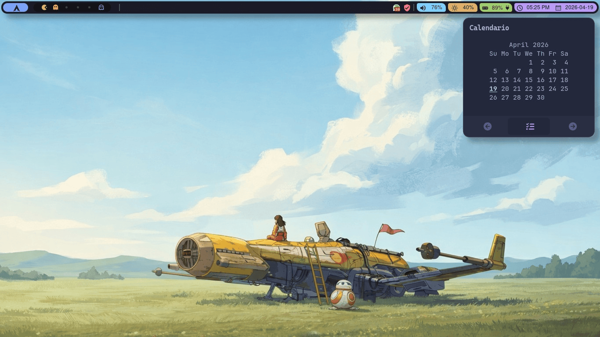
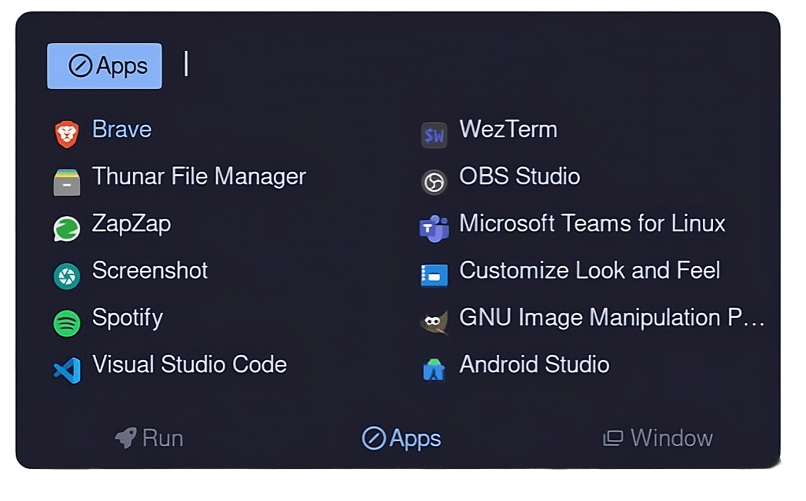
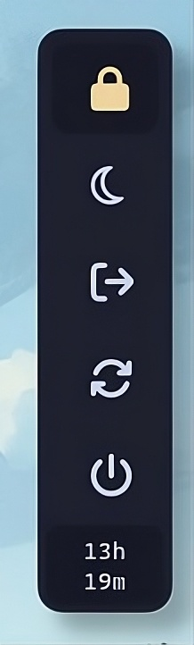
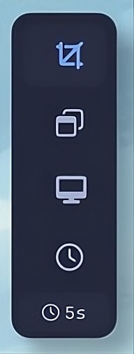
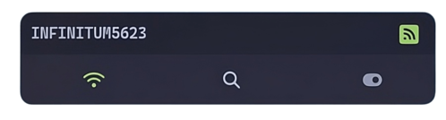
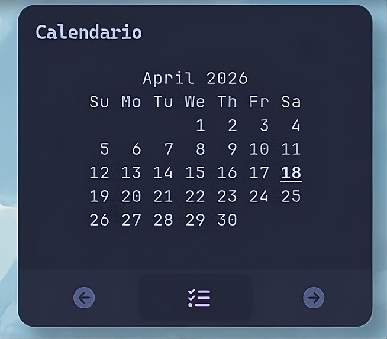

# Rofi



<p><i>Nota: Esta es solo una imagen de referencia mostrando los widgets abiertos. En realidad pueden verse distinto principalmente por la posición, ya que no se pueden abrir todos al mismo tiempo.</i></p>

<div align="center">
  <p>Colección de scripts Rofi para launcher, menús y applets</p>
</div>

---

## Showcase

<details>
<summary><b>Launcher</b></summary>


</details>

<details>
<summary><b>Runner</b></summary>


</details>

<details>
<summary><b>Powermenu</b></summary>


</details>

<details>
<summary><b>Screenshot</b></summary>


</details>

<details>
<summary><b>Wifi</b></summary>


</details>

<details>
<summary><b>Calendar</b></summary>


</details>

---

## Requisitos

### Dependencias

```sh
# Arch / Arch-based
sudo pacman -S rofi playerctl brightnessctl maim xclip xdotool networkmanager nmcli pamixer dunst

# Debian / Ubuntu
sudo apt install rofi playerctl brightnessctl maim xclip xdotool network-manager pamixer dunst

# Fedora
sudo dnf install rofi playerctl brightnessctl maim xclip xdotool NetworkManager pamixer dunst
```

### Fuentes

- **Nerd Fonts** (obligatorio para iconos)
  
  ```sh
  # Arch
  sudo pacman -S nerd-fonts-jetbrains-mono

  # Debian/Ubuntu
  sudo apt install fonts-jetbrains-mono fonts-firacode

  # Manual: https://www.nerdfonts.com/font-downloads
  ```

---

## Instalación

```sh
git clone https://github.com/ramz0/rofi.git ~/.config/rofi
```

---

## Estructura

```
rofi/
├── bin/
│   ├── launcher           # Lanzador de apps
│   ├── runner             # Ejecutar comandos
│   ├── powermenu          # Apagar/reiniciar/bloquear
│   ├── screenshot         # Capturas
│   ├── calendar           # Calendario
│   ├── wifi               # Wifi
│   ├── volume             # Volumen
│   └── volume-bar         # Popup volumen
├── config/                 # Archivos .rasi
├── icons/                  # Iconos
├── themes/                 # Temas
└── preview/               # Capturas
```

---

## Uso

| Script | Descripción |
|--------|-------------|
| [`bin/launcher`](bin/launcher) | Launcher de aplicaciones |
| [`bin/runner`](bin/runner) | Ejecutar comandos |
| [`bin/powermenu`](bin/powermenu) | Apagar/reiniciar/suspender/lock |
| [`bin/screenshot`](bin/screenshot) | Capturas de pantalla |
| [`bin/wifi`](bin/wifi) | Gestión WiFi |
| [`bin/calendar`](bin/calendar) | Calendario con tareas |

Ejecutar directamente:
```sh
~/.config/rofi/bin/launcher
~/.config/rofi/bin/powermenu
# etc...
```

---

## Atajos de teclado (Qtile)

Los scripts pueden ejecutarse desde Qtile. Más detalles en [`~/.config/qtile/shortcuts/`](https://github.com/ramz0/dotfiles/tree/main/qtile/shortcuts).

---

## Notas

- Iconos: Nerd Fonts (codepoint `\uf...`)
- Wifi: requiere `nmcli`
- Volumen: usa `pamixer`
- Calendario: lee `~/.local/share/rofi-calendar-tasks`

---

<div align="center">
  <p>Basado en el trabajo de <a href="https://github.com/mdfk15/Rofi">mdfk15/Rofi</a></p>
</div>